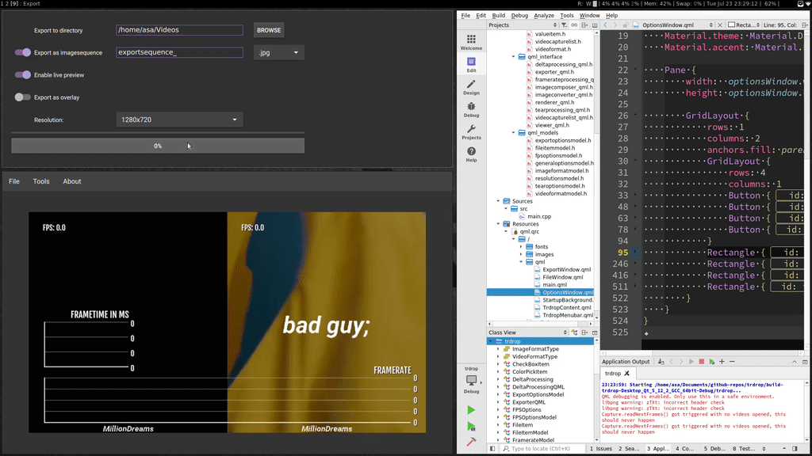
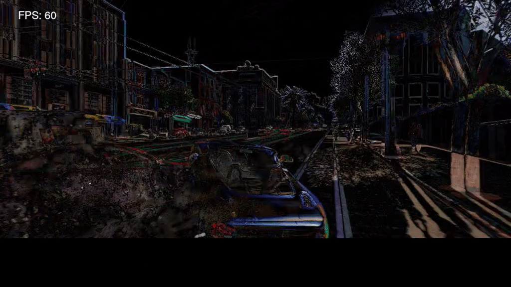
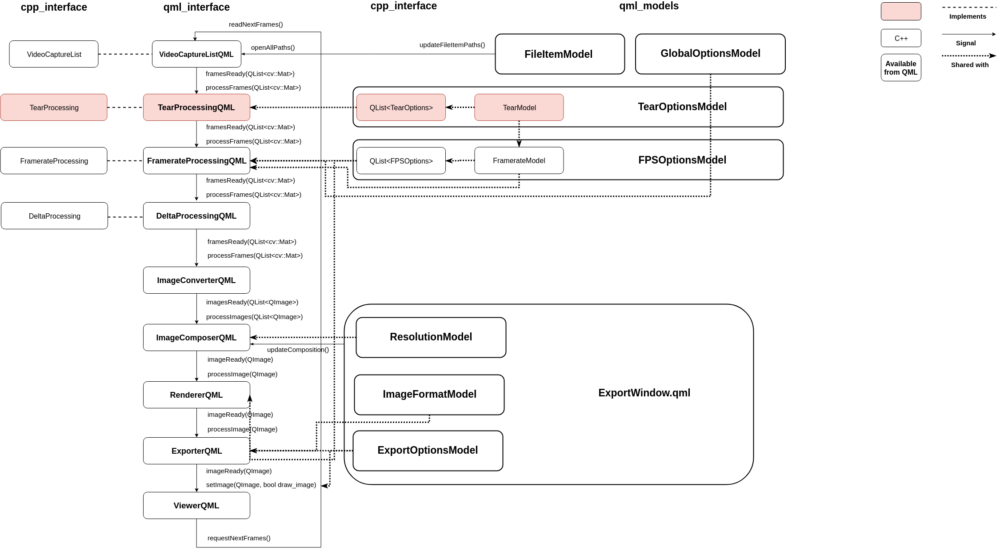
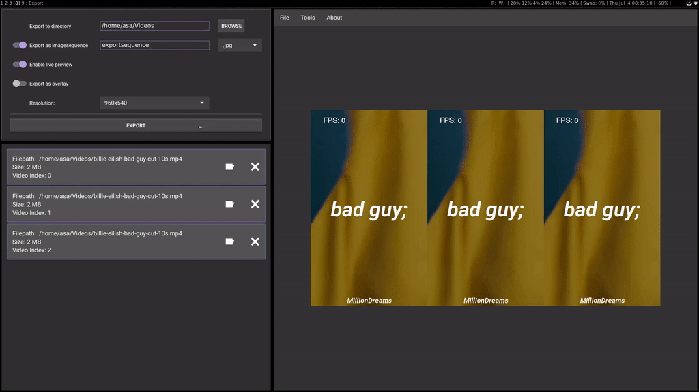
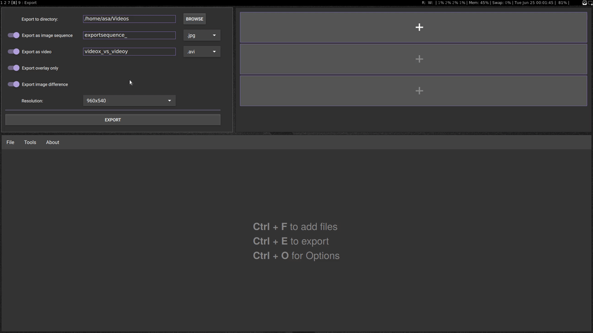
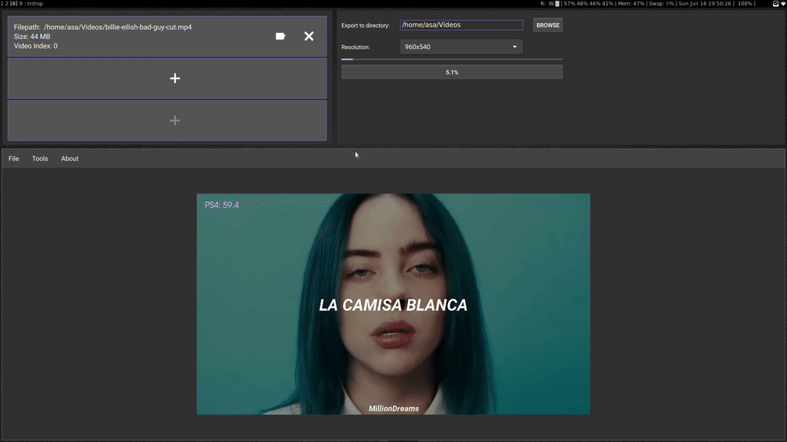

<p align="center">
    
</p>

#### Update 01.08.2019

I think I succeeded in creating an installer for Windows. Let's go merge this into master.

#### Update 28.07.2019

Added tear visualization and the csv export function. For the tear visualization you can see it either in the frametime plot as well as a single line which stays for 25 frames at the place where the tear was detected and slowly fades out (see the gif).

You can also disable this visualization if need be.


#### Update 27.07.2019

I now included a new algorithm to include the tear detection into the framerate + frametime calculation.

We currenlty support complementing tears:

* `timestep = 0, tearsize: 30% (row 0 - 30)`
* `timestep = 1, tearsize: 70% (row 31 - 100)`

This will result in the "correct" framerate of `1` in the two frames. I will probably make a visual explanation after the first official release of the qt-branch.

Now I have to think about a tear visualization and the csv export. After these features I have to learn how to deploy on Windows & Linux.

#### Update 23.07.2019

Now only drawing the x/y axis of the plots, stitched some more options together. Implemented overlay exporting with PNG. Fixed some scaling artifacts so now it looks less grainy in the preview window. Also automatic re-scaling of the main window based on your resolution.



#### Update 22.07.2019

Added shadows and eyecandy text for the plots + added the range functionality for the plots.


#### Update 21.07.2019

Added plots for both frametime and framerate processing. Fixed frametime processing too, this time it hopefully works. Plots are adaptive in scale (width is set in settings (TODO) and height is set by the highest value in the buffer).

Now we need to style the plots slightly (e.g framerate and frametime text above the plots) and stitch all the settings together + maybe create more settings.


#### Update 14.07.2019

Added frametime calculation (just a first prototype, need a plot for validation) and tear detection (similar to the one in the currently released trdrop).

Restrictions of the tear algorithm is that we only detect tears in subsequent frames as we use an algorithm that works on the difference between the frames.

Next up is the plotting!

#### Update 13.07.2019

Had multiple updates throughout the week:

* Framerate Text
    - added shadow
    - added two new fonts (see gif)
* Framerate Analysis
    - works with any recorded framerate (this was capped in the previous versions to 60 fps)
    - now extracting the recorded framerate of the clip and showing it in the File Window
* File Window
    - fixed some bugs, now moving the files also changes their order in the renderer
* Deltaprocessing
    - Added the corresponding algorithm to show how we currently calculate frames
        + this also shows tears very nicely
* Other
    - fixed some memory issues
    - added closing buttons for each window (only visible in Windows)

Next steps are implementing the frametime and tear calculation. Then we can at last get to the plotting implementation.


#### Update 09.07.2019

Added a version of delta rendering via [cv::absdiff](https://docs.opencv.org/3.4/d2/de8/group__core__array.html#ga6fef31bc8c4071cbc114a758a2b79c14).

In this gif you can see the tears. But this way of visualization is not the way we calculate the frame difference so this will be changed in the future, as this clip should have ~ 30FPS. But the general functionality is there so it's possible to change it anytime.




#### Update 08.07.2019

Got the Windows build running! Currently restricted by the 32-bit build, hopefully this won't become a problem in the future. I also created an overview of the current progress. Screenshots will follow when I adapted the window sizes.

To build on Windows, you need to follow this very much unfinished [DEVELOPMENT.md](DEVELOPMENT.md) guide.



#### Update 04.07.2019

Resetting state (fps, loaded frames currently) if the opened files are modified. Now using the shortest video to stop the export and using it to show the progress. Now I will try run this on Windows, I only need to manage to install opencv with qt correctly. Hopefully this will be finished until the end of the week.




#### Update 02.07.2019

First framerate analysis is working for multiple videos! I'm currently exporting images only and probably not implement the video encoding because it has some licensing problems which I simply ignored (h264). Importing in your favourite post-processing software is also probably easier with a imagesequence.


If you install `ffmpeg` you can simply use this command to create [the following video](videos/2019-07-02-first-fps-analysis.mp4).

```bash
> ffmpeg -framerate 30 -i exportsequence_%10d.jpg  -c:v libx264 -pix_fmt yuv420p analysis.mp4
```

#### Update 25.06.2019

Found a QImage to OpenCV convertion, but determined that its not necessarily needed yet, as I can also save QImages directly to the hard drive. Finalized the gui of the export settings, now I have to make it functional.



#### Update 23.06.2019

Not a very gif'able update, but I've rewritten the processing pipeline and grouped the headers by usage. A problem I've encountered was that I could not save images which were outside of the screen-resolution, which prompted me to rewrite some parts, but that is now also fixed.
The only thing to test right now is the conversion between internal qt images to opencv to encode a new video. This should be only a matter of time, but then it's only about adding the missing features, which should not prove to be as difficult as the project structure until now.


#### Update 17.06.2019

Finally got the Framerate Text working on resize and for multiple videos simultaneously.



#### Update 11.06.2019

Options are now enabled dependent on the amount of the videos that are selected. I also got some text overlay from the options rendered over the video, currently working on making it scale by size.


#### Update 10.06.2019

Resizing from export dialog works, even live. Default export location is movies on every platform (os-indepedent). Composing now works too, but not automatic centering if the ratio is different (16:9) -> (4:3) will produce black beams, may fix this later.


#### Update 08.06.2019

Started with the export dialog, got progress bar working, an export button and started with choosing the directory. Also working on the composing tool for multiple videos and automatic resizing, but as you can see in the gif some of the image channels are still wrongly displayed.


#### Update 02.06.2019

Fused the FileDialog with the rendering for up to 3 videos in parallel. Currenlty still rendering only one video at a time. The Rendering Button is for debugging purposes, will be the export window in the future.


#### Update 31.05.2019

Working Video playback in QML from OpenCV, now giving the FileDialog the functionality behind the scenes. After this we will try some overlays

#### Update 28.05.2019

Got OpenCV finally to show videos in a QWidget. Now it's up to do that in QML.

#### Update 23.05.2019

Added more general options with a custom spinbox with text. Also tearoptions with a shared color option. Tooltips work on the general pane but not the others yet? Also got OpenCV running from a previous project on Linux, now porting it to Windows.


#### Update 20.05.2019

Added the Framerate options with a color picking / font picking / text editing functionality. Also added a reset settings button.

[Webm this time, gif convertion failed](images/2019-05-20-fps-options-progress.webm)

#### Update 16.05.2019

Started with the options menu. Colorpicking works!


#### Update 14.05.2019

Got the fileitemmodel working with c++ and qml. Added transition animations because they look good. Now focusing on the options dialog. Hopefully this will be faster as the model will be the same implementation as the fileitem one.

.

#### Update 12.05.2019

Created the qt branch, currently building up the knowledge needed to use the Qt MVC model. Rebuilding the QML example to work from C++ to incorporate OpenCV.

This is the current progress video for the file choose dialog with ordering.

.

#### Update 24.04.2019

I'm currently working on a cross platform (Win/Linux) Qt based implementation. Currently testing some of the key functionalities in private repos. Stay tuned!

